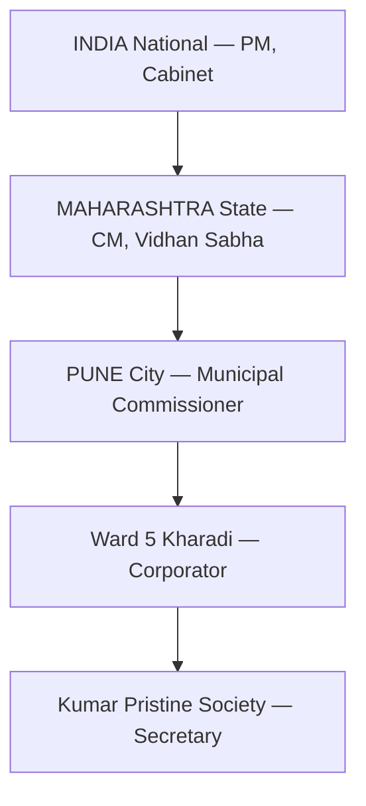

<div align="center">
  

  <h1>सुशासन — Sushasan</h1>
  <p><strong>Where Citizens and Government Build Solutions Together</strong></p>

  <p>
    <a href="https://harsh147-github.github.io/Project_Svyas/"><b>🌐 Website</b></a> ·
    <a href="https://478421c3-f633-4888-a301-72a61c9235bc-00-3n2i4ddsygvo9.worf.replit.dev/app"><b>🚀 Try the MVP</b></a>
  </p>
  <br/>
</div>

PMC built 400km of roads in 75 days for the Bajaj Grand Tour. The capability was never the problem — **the infrastructure to channel citizen intelligence to decision-makers was.**

**Sushasan is that infrastructure.** A platform where every citizen's perspective joins together through AI — not to collect opinions, but to build optimized solutions where every factor is considered. The solutions are ready. Only execution awaits. 🇮🇳

> **It's not about collecting 1.4 billion opinions.**
> **It's about joining them together — into solutions where every factor is considered.**
> **Not the best decision. The most considered one.**

---

## 🤝 The Idea

India is the world's most powerful democracy. Every day, 1.4 billion citizens think about how to make their communities better — but there's no way to bring all those ideas together.

Sushasan changes that. When thousands of people share what they see in their communities — in any language, any dialect, voice or text — AI doesn't just listen. It **joins every perspective together** into one optimized solution where all factors, all constraints, every community impact has been weighed.

The result? A **transparent national dashboard** where every optimized solution is visible to everyone — citizens, officials, media. Complete transparency on what's being discussed, what's been solved, and what awaits execution.

---

## ⚡ How It Works

```
Citizens share what they see    →    AI joins every perspective    →    Optimized solution    →    Visible to everyone
(any language, voice/text)           (weighs all factors)               (not majority rules)       (transparent dashboard)
```

1. **Anyone Can Contribute** — Say *"paani nahi aa raha subah se"* — that's it. Any language, any dialect, voice or text. In 5 seconds, your perspective joins the bigger picture.
2. **Every Voice Joins the Picture** — Each perspective is understood, geotagged, and connected to others. Building a complete picture no single person could see alone.
3. **AI Weighs Every Factor** — Deep neural networks join all perspectives: root causes, affected areas, feasibility, budget. An optimized solution where every constraint is considered.
4. **Citizens & Government Act Together** — A clear, considered solution reaches the right people — with full transparency back to the community.

---

## 🏛️ Built for Everyone

### 👤 For Citizens
- **Zero-friction contribution** — any language (voice, text, images). Just speak your reality.
- **Contribution attribution** — when your insight shapes a solution, you know.
- **Real-time progress tracking** — received → synthesized → routed → acknowledged → in progress → resolved.
- **Full transparency** — see exactly how decisions are being made and what awaits execution.

### 🏛 For Decision-Makers
- **Prioritized intelligence queue** — ranked issues with community consensus and ready solutions.
- **AI-generated action plans** — root cause, recommended actions, cost estimates, affected population, department dependencies.
- **Early warning system** — detect emerging crises before they escalate.
- **Budget justification** — evidence-backed proposals with real citizen data.
- **Performance transparency** — response tracking visible to everyone.

---

## 🧠 The AI Engine

| Job | Model | What It Does |
|-----|-------|--------------|
| **UNDERSTAND** | `gpt-4o-mini` | Converts casual input in any language into structured intelligence. Auto-detects language. < 3s. |
| **CONNECT** | `gpt-4o-mini` | Classifies governance level (Ward → City → State → National) and routes to the right people. < 2s. |
| **SYNTHESIZE** | `gpt-4o` | Joins thousands of perspectives into one optimized solution — root causes, actions, costs. 5-15s. |
| **OPTIMIZE** | `gpt-4o` | Weighs all factors — feasibility, budget, community impact — to find the most considered solution. |
| **INTERCONNECT** | `gpt-4o` | Maps relationships between problems across departments. Coordinates parallel resolution. |
| **ESCALATE** | Async | When 5+ locations report the same problem, auto-escalates to the parent authority. |

---

## 📊 Transparent National Dashboard

Every optimized solution is visible to everyone — citizens, officials, media. No solutions locked behind bureaucratic walls.

```
┌─────────────────────────────────────────────────────────────────┐
│  sushasan.in/dashboard                          🟢 LIVE — ALL  │
├──────────────────┬──────────────────────────────────────────────┤
│ Top Issues       │  Water Supply — Ward 12, Pune               │
│                  │  ┌────────┐ ┌────────┐ ┌────────┐           │
│ ● Water Supply   │  │ 12,847 │ │ 94.2%  │ │ ₹4.2Cr │           │
│ ● Traffic        │  │ voices │ │ consns │ │  cost  │           │
│ ● Sanitation     │  └────────┘ └────────┘ └────────┘           │
│ ● Power Outages  │                                              │
│ ● Public Transit │  SOLUTION: Pipeline rehabilitation,          │
│                  │  Sector 7 main line. Phased over 6 months.  │
│                  │                                              │
│                  │  DEPTS: Municipal Water Board, PWD           │
│                  │  STATUS: ✅ Solution Ready — Awaits Exec    │
└──────────────────┴──────────────────────────────────────────────┘
```

---

## 📊 Governance Hierarchy & Auto-Escalation



**Auto-escalation:** `5+ wards` → City-level · `5+ cities` → State-level · `5+ states` → National-level

---

## 🚀 The Vision

**Aadhaar** gave every Indian a verifiable identity. **UPI** gave every Indian seamless payments. **Sushasan** gives every Indian a way to participate in solving the nation's problems — together.

<div align="center">
  <h3>Aadhaar → Identity</h3>
  <h3>UPI → Payments</h3>
  <h3>Sushasan → Participation</h3>
</div>

---

## 💻 Tech Stack

- **Frontend:** React 18 / Vite / TailwindCSS v4 / Framer Motion / wouter / TanStack Query
- **Backend:** Express.js / PostgreSQL / Drizzle ORM / Redis (Upstash) / BullMQ
- **AI:** OpenAI API (`gpt-4o-mini`, `gpt-4o`) / Structured JSON outputs
- **Auth:** Phone OTP via Firebase Auth / JWT / Redis-backed sessions
- **Infra:** GitHub Pages (website) / Railway (backend) / Neon.tech (DB)
- **Website:** Built with Framer

> **Cost:** Runs the entire platform for a medium-to-large city at ~$20-35/month.

---

## 🗺️ Execution Roadmap

| Phase | Milestone |
|-------|-----------|
| **1. Pilot** | 3 municipal wards in Pune. Validate input quality, AI accuracy, official adoption. Target: 10,000 inputs. |
| **2. City-Wide** | Full Pune Municipal Corporation. WhatsApp + voice channels. Grievance system integration. Target: 100,000 inputs. |
| **3. Multi-City** | 5 major Indian cities. Inter-city pattern detection. Decision-maker dashboards. Target: 1M inputs. |
| **4. National** | Full national deployment as Digital Public Good. Auto-escalation across all tiers. Open API. Target: 1.4B citizens. |

---

<div align="center">
  <p><b>Built by Harsh Sonawane — Pune, India</b></p>
  <i>The capability was never the problem. The infrastructure was. Sushasan is that infrastructure. 🇮🇳</i>
</div>
