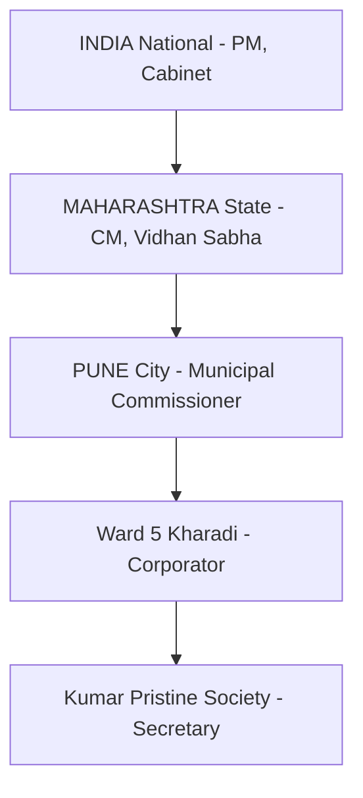

 

  
  
  <h1 style="margin: 0; padding: 0;">Sushasan (सुशासन)</h1>
  
<strong>Collective Intelligence for Good Governance</strong>

  

    <a href="https://harsh147-github.github.io/Project_Svyas/"><b>🌐 Live Manifesto</b></a> &middot; 
    <a href="https://478421c3-f633-4888-a301-72a61c9235bc-00-3n2i4ddsygvo9.worf.replit.dev/app"><b>🚀 Try the MVP</b></a>
  

   

India votes once every 5 years. Between elections, 1.4 billion people have **zero structured mechanism** to tell decision-makers what they need. CPGRAMS has 62% satisfaction. PMC Road Mitra died in 6 months. Twitter is noise without synthesis. Change.org collects signatures with no solutions.

**Sushasan is the pipe that should always have existed.** 🇮🇳

Citizens contribute "vibe answers" — casual, low-friction inputs about local problems in any language. Our backend AI synthesizes thousands of these into optimal, structured solutions with confidence scores, action items, cost estimates, and responsible authorities. A transparent dashboard serves **both citizens and decision-makers** at every governance level — from your housing society secretary to Parliament.

> **Voting says "I choose you."**  
> **Sushasan says "Here's what we need, here's how to do it, and here's our support."**

---

## 🌟 What Makes Sushasan Different?
*Without AI, this is Reddit. With AI, this is national infrastructure.*

1. **Lowers the Bar** — Say *"paani nahi aa raha subah se"* and AI converts it into structured governance intelligence. Any language. 5 seconds.
2. **Synthesizes at Scale** — 10,000 citizen opinions become **ONE** optimal solution with weighted themes, action items, cost estimates, and responsible authorities. 15 seconds.
3. **Routes Intelligently** — AI knows a pothole is a ward problem and a water policy is a state problem. Auto-classifies and routes to the exact right desk.
4. **Interconnects Problems** — "Hinjewadi traffic" isn't a singular issue — it's 4 sub-problems across 4 departments. Sushasan decomposes compound crises for parallel resolution.

---

## 🏛️ Dual Interface: Citizens & Decision-Makers

### 👤 For Citizens
- **Zero-friction contribution** in any language (voice, text, images).
- AI refines casual input into structured intelligence (you approve or correct).
- See exactly how YOUR input shaped the final synthesis **(contribution attribution)**.
- Transparent dashboard at every governance level.
- Track progress — see exactly when authorities respond and what definitive actions they take.

### 🏛 For Decision-Makers (The Authority Dashboard)
- **Prioritized intelligence queue** — ranked problems with urgency scores and ready solutions.
- **AI-synthesized action plans** — actionable items, responsible department, cost estimate, and timeline.
- **Early warning system** — Auto-escalation triggers when 5+ wards report the same systemic issue.
- **Problem decomposition** — compound crises broken into parallel operational workstreams.
- **One-click response** — respond publicly and get credit for being digitally responsive.
- **Performance metrics** — response rate tracking per department for performance reviews.
- **Budget justification** — *"2,341 verified citizens need X, AI estimates ₹45Cr"* — data-backed spending.

---

## 🧠 The AI Engine — 6 Autonomous Jobs

| Job | Trigger | Model | Latency | What It Does |
|-----|---------|-------|---------|--------------|
| **REFINE** | New input | `gpt-4o-mini` | `< 3s` | Converts casual vibe input into structured intelligence. Auto-detects language. |
| **ROUTE** | New problem | `gpt-4o-mini` | `< 2s` | Classifies governance level and routes to correct authority/department. |
| **SYNTHESIZE**| 15/50 inputs| `gpt-4o` | `5-15s` | Aggregates all inputs into an optimal solution with themes, action items, costs. |
| **BUBBLE-UP** | Every 6 hrs | `gpt-4o` | `Async` | Detects 5+ child locations with same problem &rarr; auto-escalates to parent level. |
| **INTERCONNECT**| On synthesis| `gpt-4o` | `5-10s` | Maps causal relationships. Decomposes compound problems for parallel resolution. |
| **PETITION** | Created | `gpt-4o` | `5-10s` | Generates a formal petition with RTI-ready language and PDF. |

---

## 📊 Governance Hierarchy & Auto-Escalation

**Auto-escalation Logic:**
- `5+ wards` reporting the same problem &rarr; City-level synthesis.
- `5+ cities` reporting the same problem &rarr; State-level synthesis.
- `5+ states` reporting the same problem &rarr; National-level synthesis.

---

## 💻 Tech Stack (Full Platform)

- **Frontend:** React 18 / Vite / TailwindCSS v4 / Framer Motion / wouter / TanStack Query
- **Backend:** Express.js / PostgreSQL / Drizzle ORM / Redis (Upstash) / BullMQ
- **AI Integration:** OpenAI API (`gpt-4o-mini`, `gpt-4o`) / Structured JSON outputs 
- **Authentication:** Phone OTP via Firebase Auth / JWT / Redis-backed sessions
- **Infrastructure:** GitHub Pages (manifesto) / Railway (backend) / Neon.tech (DB)

> **Cost Efficiency:** Runs the entire platform compute for a medium-to-large city for ~$20-35/month.

---

## 🚀 The Vision: A New Digital Public Good

**Aadhaar** gave every Indian a verifiable identity. **UPI** gave every Indian a seamless payment system. **Sushasan** gives every Indian a voice that decision-makers can actually hear and act upon.

  <h3>Aadhaar &rarr; Identity</h3>
  <h3>UPI &rarr; Payments</h3>
  <h3 style="color: #FF9933;">Sushasan &rarr; Participation</h3>

---

## 🗺️ Execution Roadmap

| Phase | Timeline | Milestone |
|-------|----------|-----------|
| **1. Pilot** | Month 1-3 | One city (Pune). 50 users. First petition submitted to PMC. Commissioner sees Authority Dashboard. |
| **2. Expand** | Month 3-6 | Multi-city (Mumbai, Bangalore). State dashboards live. WhatsApp bot integration. |
| **3. National** | Month 6-12 | 100 Smart Cities. Central government dashboard. CPGRAMS integration. BHASHINI for 22 languages. |
| **4. Scale** | Year 2+ | Panchayat to Parliament. Custom ML models. India exports the model to other democracies. |

---

  
<b>Built By Harsh Sonawane — Pune, India</b>

  <i>This is not a side project. This is a mission to build the democratic infrastructure India was always supposed to have. 🇮🇳</i>
    
  
Data sourced from PRS Legislative Research, Official Lok Sabha/Rajya Sabha records, DARPG Annual Reports, and verified Indian journalism.

